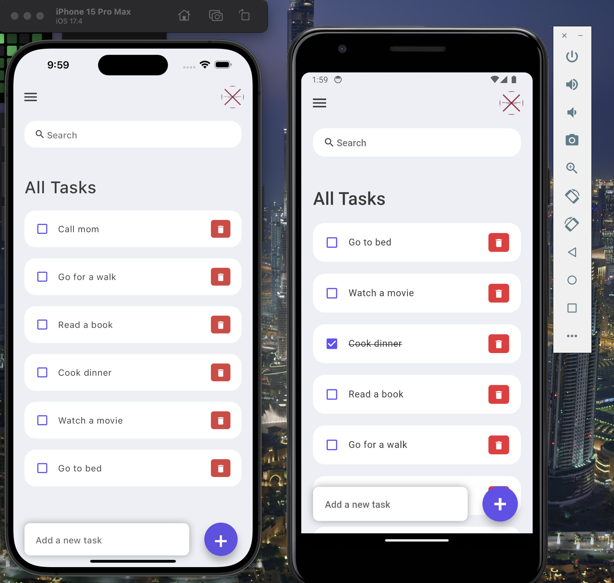

# ClearList: The Ultimate Flutter ToDo App

###  Overview

**ClearList** is a streamlined and user-friendly task management application, crafted to assist users in efficiently organizing their daily tasks and priorities. Developed within a concise timeframe of 5 hours, this app exemplifies the capabilities of Flutter and Dart in delivering top-notch mobile applications for both iOS and Android platforms using a unified codebase.

### Enhanced Features Section

- **User-Centric Design:** The app boasts a minimalist interface, ensuring a smooth and focused task management experience.
- **Universal Compatibility:** Leveraging Flutter, the app offers a seamless experience across both Android and iOS platforms.
- **Dynamic Task Management:** Facilitates real-time addition, completion, and removal of tasks, making task management dynamic and hassle-free.
- **Organized Task Categories:** Enhances focus and efficiency by allowing users to categorize tasks.
- **Theme Flexibility:** Includes both dark and light modes to cater to user preference and to minimize eye strain, especially in low-light conditions.


### App Screenshot


**Home Screen**



### Streamlined Getting Started Guide

To set up the app locally, follow these steps:

#### Prerequisites

Ensure you have the following installed:
- Flutter SDK
- Dart SDK
- An IDE with Flutter support, such as VS Code or Android Studio

#### Installation Guide

1. Clone the repository:
   ```sh
   git clone https://github.com/iPrakharV/ClearList-The_Ultimate_Flutter_ToDo_App
   ```
2. Change to the project directory:
   ```sh
   cd FlutterToDoApp
   ```
3. Install dependencies:
   ```sh
   flutter pub get
   ```
4. Launch the app on a connected device or emulator:
   ```sh
   flutter run
   ```

### Improved Contribution Guidelines

We welcome contributions, as they foster the open-source spirit of learning, inspiration, and creativity. To contribute:

1. Fork the project repository.
2. Create a feature branch (`git checkout -b feature/YourFeature`).
3. Commit your changes (`git commit -m 'Introduce YourFeature'`).
4. Push to the branch (`git push origin feature/YourFeature`).
5. Initiate a Pull Request.

### Licensing and Acknowledgments

**License:** The app is distributed under the MIT License. Refer to the `LICENSE` file for more details.

**Acknowledgments:**
- Kudos to the Flutter community and documentation for invaluable resources.


